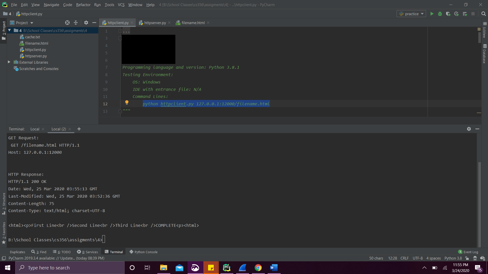
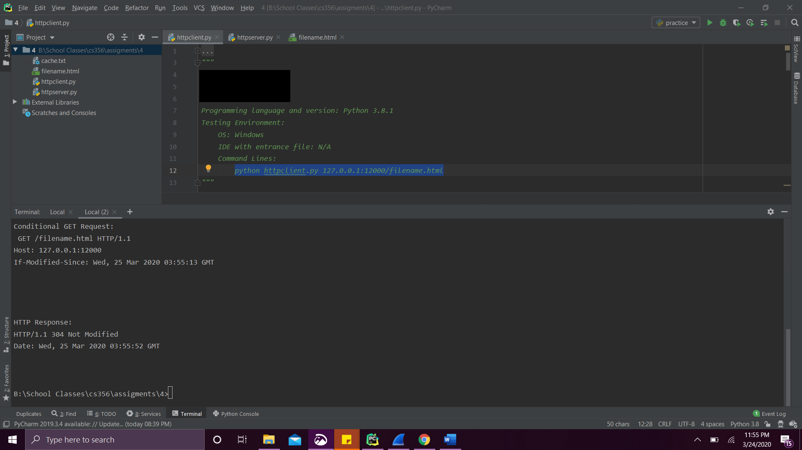
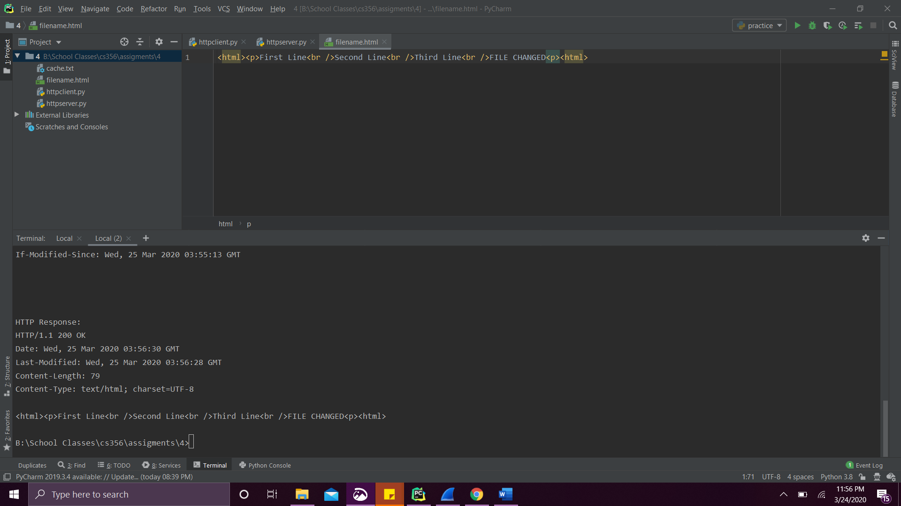
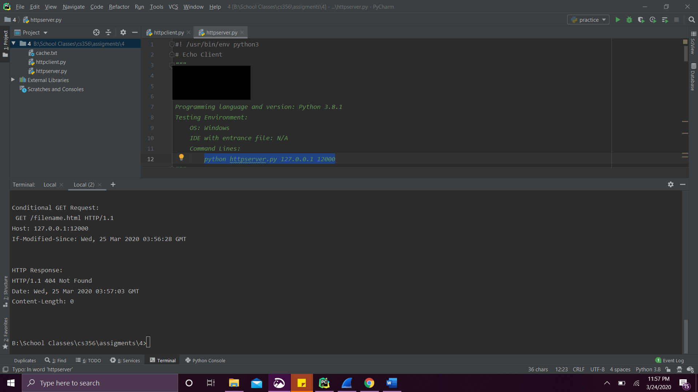

# http
_This project is from my networking class and the requirements belong to my professor_

1. The program uses HTTP natively.
2. Client and server programs use command-line arguments
3. Server program use relative filename (file in current directory)

Program uses TCP sockets, it represents a simplified version of a HTTP client and server. The client program uses 
the HTTP protocol to fetch a web page (stored in a file) from the server using the HTTP GET method,
cache it, and then subsequently use conditional GET operations to fetch the file only if it has been
modified.
 

The HTTP client performs the following functions:
1. Takes in a single command line argument that specifies a web url containing the hostname and port
where the server is running, as well as the name of the file to be fetched.
2. If the file is not yet cached, a HTTP GET operation fetches the file named in the URL\
   - Prints out the contents of the file\
   - Caches the file
3. If the file is cached, it uses a Conditional GET operation for the file named in the URL
   - If the server indicates the file has not been modified since last downloaded, it prints output
saying so.
   - Otherwise, it indicates that the file has been modified, and prints and caches new contents
 

The HTTP server performs the following functions:
1. Reads a command-line argument specifying IP address and port server is to listen on.
2. Opens a TCP socket and listens for incoming HTTP Get and Conditional GET requests from one or more
HTTP Clients
3. In the case of a HTTP Get request:\
   - Reads the named file and returns a HTTP GET Response, including the Last-Modified header
field
4. In the case of a HTTP Conditional Get Request:\
   - If the file has not been modified since that indicated by If-Modified-Since, returns the
appropriate Not Modified response (return code 304)
   - If the file has been modified, returns the file contents.
5. In the case that the named file does not exist, returns the appropriate “Not Found” error (return
code 404)
6. The server ignores all header fields in HTTP Requests it does not understand

###Test cases
#### Web Object has not been cached

 
 
#### Web Object has been cached, but not modified

 
 

#### Web Object has been cached, but modified

 
 
#### Web Object does not been exist
